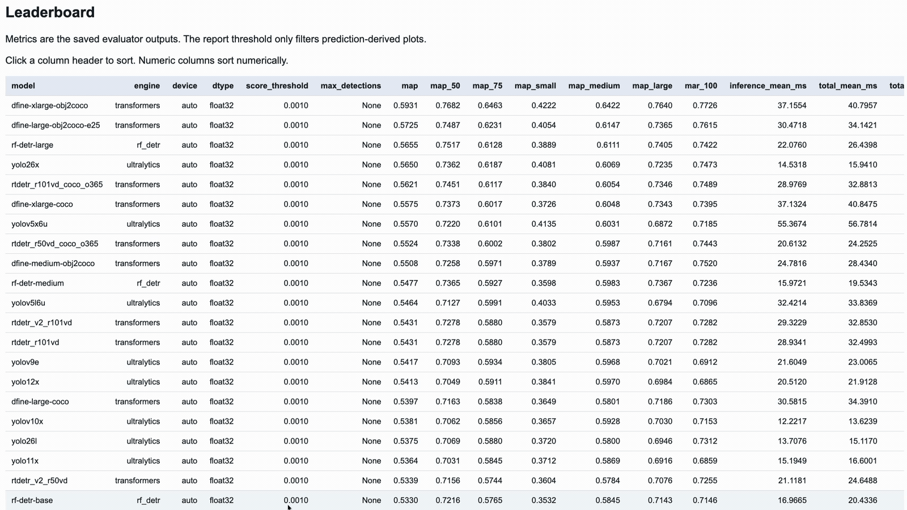
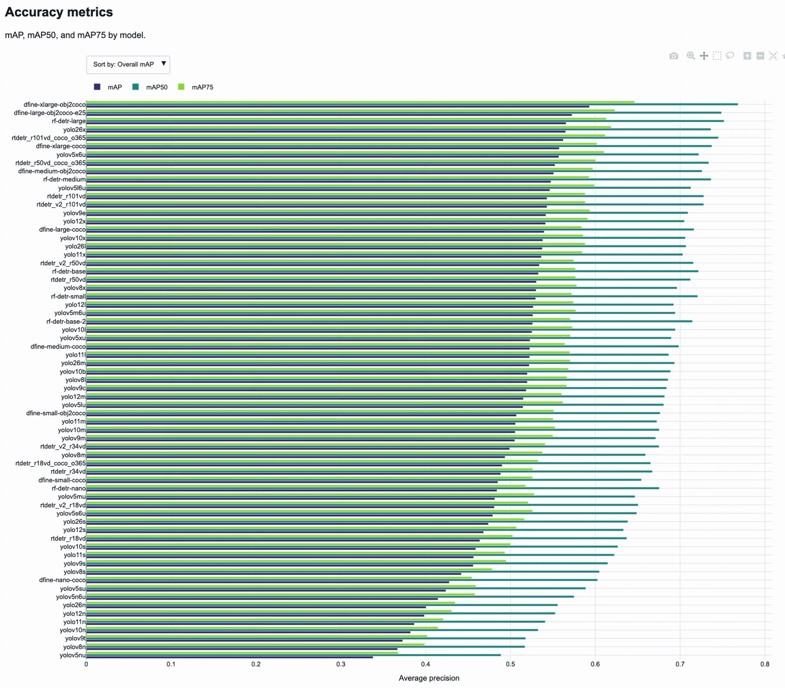
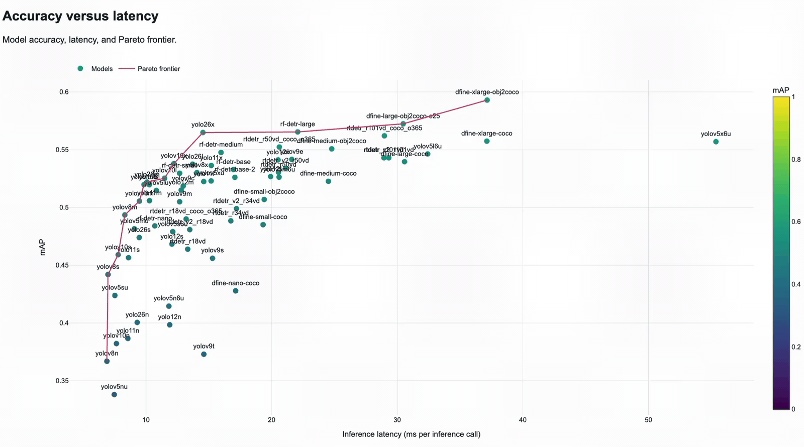
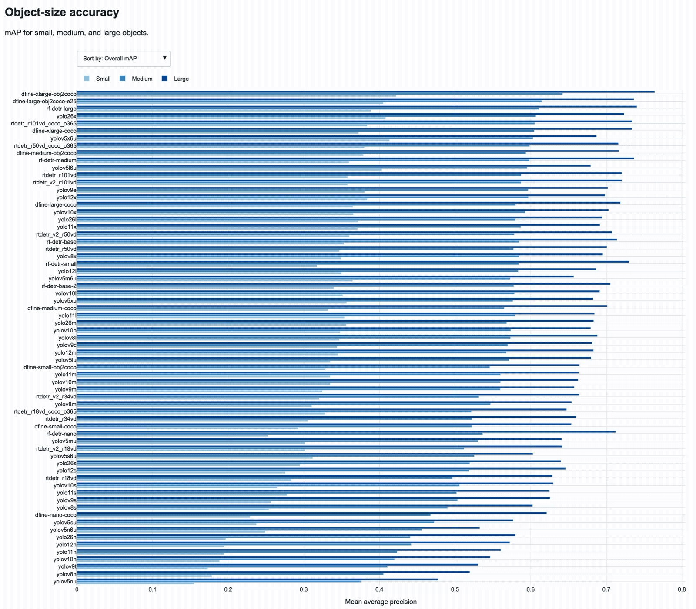
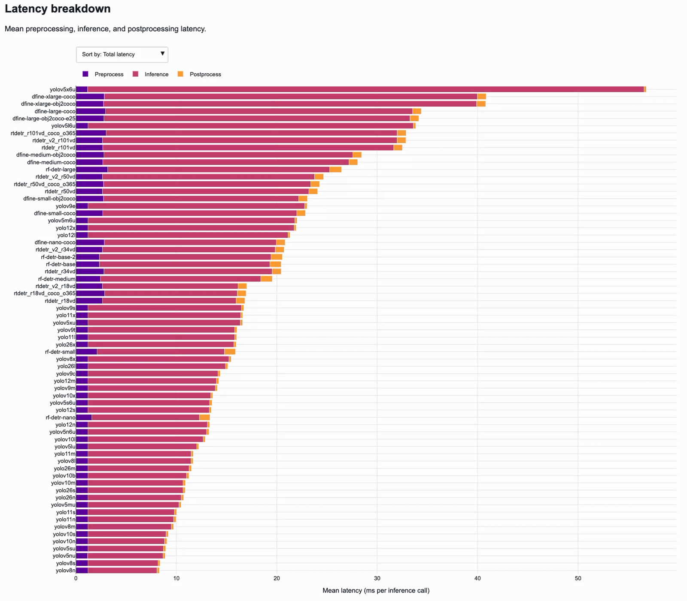
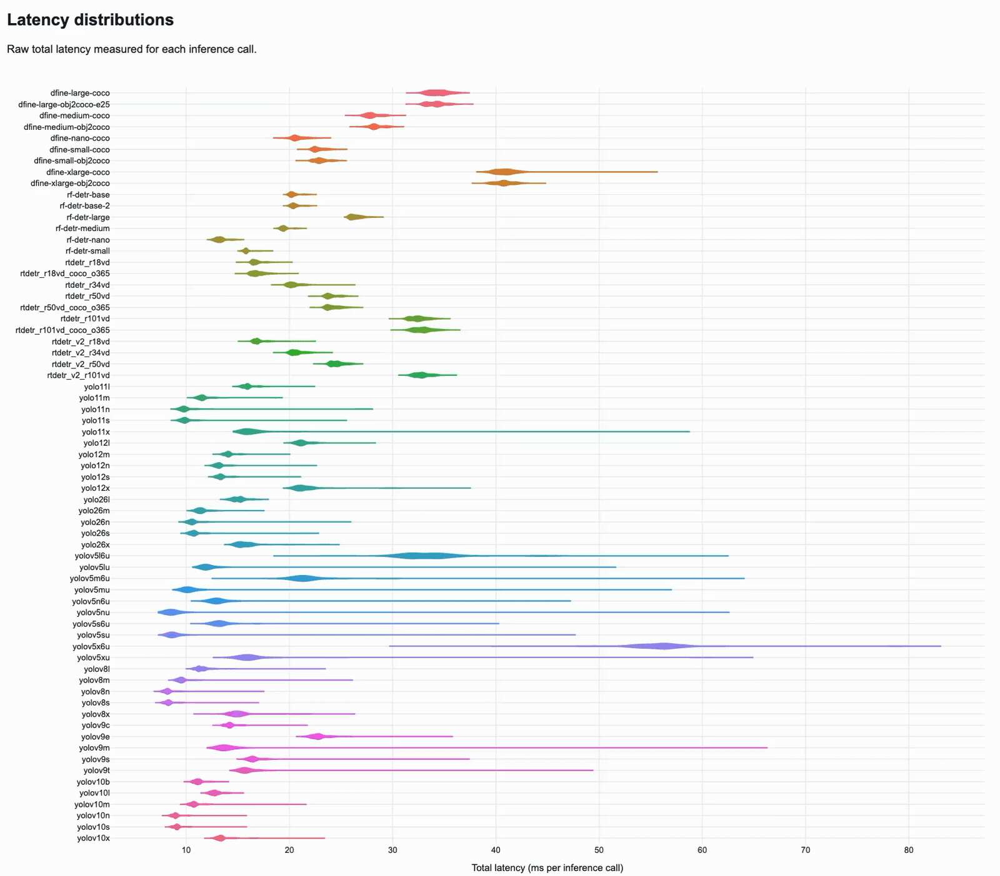
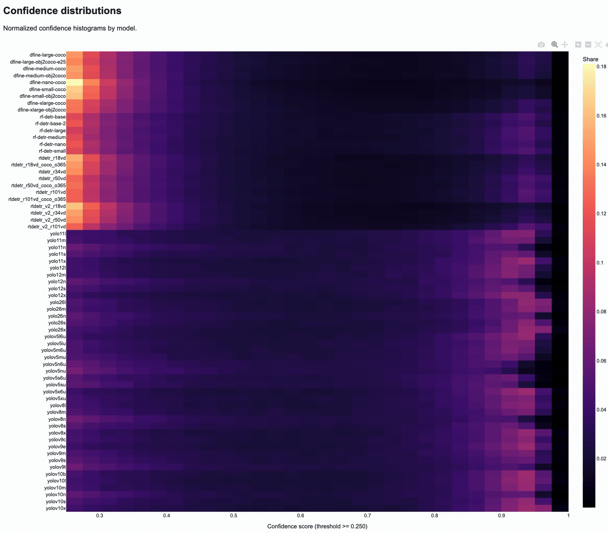

# Object Detectors Evaluation

Object Detectors Evaluation is a Python toolkit for comparing object detection models on detection datasets. It covers
the full local workflow: dataset preparation, model download, inference, metric calculation, latency measurement, run
artifacts, and report generation.

The current repository focuses on COCO-style detector evaluation with the included dataset wrappers, model registry,
inference engines, TorchMetrics mAP metrics, and offline report output.

## Table Of Contents

- [Overview](#overview)
- [Features](#features)
- [Installation](#installation)
- [Quick Start](#quick-start)
- [Report Preview](#report-preview)
  - [Example Report](#example-report)
  - [Leaderboard](#leaderboard)
  - [Accuracy Metrics](#accuracy-metrics)
  - [Accuracy Versus Latency](#accuracy-versus-latency)
  - [Per-Class Accuracy](#per-class-accuracy)
  - [Object Size Accuracy](#object-size-accuracy)
  - [Latency](#latency)
  - [Latency Distribution](#latency-distribution)
  - [Confidence Distribution](#confidence-distribution)
- [Usage](#usage)
  - [Scripts](#scripts)
  - [Datasets](#datasets)
  - [Models](#models)
  - [Inference](#inference)
  - [Evaluation](#evaluation)
  - [Reports](#reports)
- [Outputs](#outputs)
  - [Run Outputs](#run-outputs)
  - [Configuration](#configuration)
- [Development](#development)
  - [Project Layout](#project-layout)
- [Current Scope](#current-scope)

## Overview

The evaluation flow is config-driven:

```text
dataset config
    -> dataset object
    -> model spec
    -> model artifact
    -> inference engine
    -> predictions and latency
    -> metrics and artifacts
    -> HTML report and PNG figures
```

The evaluator can run multiple registered models against the same dataset, save normalized predictions and targets,
compute mAP metrics, summarize latency, and generate a report for model comparison.

## Features

- `COCODataset` and `OpenImagesDataset` dataset wrappers.
- FiftyOne-based dataset download scripts for COCO and Open Images.
- Dataset creation and visualization scripts.
- Model registry with specs for supported detector collections.
- Hugging Face and direct-URL model downloaders.
- Inference engines for Transformers, Ultralytics, and RF-DETR models.
- RF-DETR COCO class ID remapping for compatible COCO evaluation.
- TorchMetrics mean average precision evaluation.
- Latency measurement for preprocess, inference, postprocess, and total runtime.
- JSON and JSONL artifacts for configs, class maps, targets, predictions, metrics, and latency.
- Offline report generation with Plotly HTML and static PNG figures.

## Installation

This project uses [uv](https://docs.astral.sh/uv/) to manage dependencies and run scripts.

Install project dependencies:

```bash
uv sync
```

Install development dependencies:

```bash
uv sync --group dev
```

Install without development dependencies:

```bash
uv sync --no-dev
```

## Quick Start

List registered models:

```bash
uv run python scripts/models/list_models.py
```

Download a small COCO validation subset:

```bash
uv run python scripts/datasets/download_coco_dataset.py
```

Download all COCO validation samples:

```bash
uv run python scripts/datasets/download_coco_dataset.py --all-samples
```

Download one registered model:

```bash
uv run python scripts/models/download_model.py --model-name yolov8n
```

Run an example evaluation:

```bash
uv run python scripts/evaluation/run_detection_evaluator.py \
    --config-filepath configs/detection_evaluator_coco_example.yaml
```

Generate a report for a completed run:

```bash
uv run python scripts/evaluation/generate_detection_report.py \
    --run-dirpath runs/detectors_eval/<RUN_NAME> \
    --overwrite
```

## Report Preview

The report summarizes accuracy, latency, prediction confidence, per-class behavior, and model ranking. The bundled
example report was generated from a COCO validation run across all currently supported model specs and includes both the
offline HTML report and PNG figures.

### Example Report

The repository includes a generated COCO validation report example in `docs/report_example`:

- [docs/report_example/index.html](docs/report_example/index.html): offline Plotly HTML report.
- [docs/report_example/leaderboard.csv](docs/report_example/leaderboard.csv): model leaderboard table.
- [docs/report_example/figures](docs/report_example/figures): static PNG figures exported from the report.

PNG figures included in the example report:

- [accuracy_latency.png](docs/report_example/figures/accuracy_latency.png)
- [confidence_distribution.png](docs/report_example/figures/confidence_distribution.png)
- [latency_breakdown.png](docs/report_example/figures/latency_breakdown.png)
- [latency_distribution.png](docs/report_example/figures/latency_distribution.png)
- [metrics_comparison.png](docs/report_example/figures/metrics_comparison.png)
- [object_size_map.png](docs/report_example/figures/object_size_map.png)
- [per_class_map.png](docs/report_example/figures/per_class_map.png)
- [prediction_counts.png](docs/report_example/figures/prediction_counts.png)

### Leaderboard



### Accuracy Metrics



### Accuracy Versus Latency



### Per-Class Accuracy


### Object Size Accuracy



### Latency



### Latency Distribution



### Confidence Distribution



## Usage

### Scripts

All scripts use `argparse` and expose their available arguments through `--help`:

```bash
uv run python scripts/evaluation/run_detection_evaluator.py --help
```

Dataset scripts:

```text
scripts/datasets/create_coco_dataset.py
scripts/datasets/create_open_images_dataset.py
scripts/datasets/download_coco_dataset.py
scripts/datasets/download_open_images_dataset.py
scripts/datasets/visualize_coco_dataset.py
scripts/datasets/visualize_open_images_dataset.py
```

Model scripts:

```text
scripts/models/list_models.py
scripts/models/download_model.py
scripts/models/download_all_models.py
scripts/models/download_huggingface_model.py
scripts/models/download_url_model.py
```

Inference and evaluation scripts:

```text
scripts/inference/run_inference.py
scripts/evaluation/run_detection_evaluator.py
scripts/evaluation/generate_detection_report.py
```

### Datasets

Datasets live under `datasets/fiftyone` by default. The path is controlled by `FIFTYONE_DATASETS_DIRPATH` in
`src/object_detectors_evaluation/consts.py`.

Supported dataset wrappers:

- `COCODataset`
- `OpenImagesDataset`

Dataset config supports:

- `dataset_dirpath`: dataset directory.
- `split`: `train`, `validation`, or `test`.
- `classes_of_interest`: optional class filtering.
- `include_crowd`: include crowd annotations in targets.
- `drop_images_with_crowd`: remove images containing crowd annotations.
- `remove_empty_images`: remove images without retained annotations.

Download scripts:

```bash
uv run python scripts/datasets/download_coco_dataset.py
uv run python scripts/datasets/download_open_images_dataset.py
```

Dataset object smoke scripts:

```bash
uv run python scripts/datasets/create_coco_dataset.py
uv run python scripts/datasets/create_open_images_dataset.py
```

Visualization scripts:

```bash
uv run python scripts/datasets/visualize_coco_dataset.py
uv run python scripts/datasets/visualize_open_images_dataset.py
```

### Models

Models are registered through `ModelSpec` objects in:

```text
src/object_detectors_evaluation/models/collections/
```

Current model collections include:

- D-FINE
- RF-DETR
- RT-DETR
- Ultralytics YOLO

The all-model COCO config includes the full list of currently supported registered models:

```text
D-FINE:
    dfine-nano-coco
    dfine-small-coco
    dfine-medium-coco
    dfine-large-coco
    dfine-xlarge-coco
    dfine-small-obj2coco
    dfine-medium-obj2coco
    dfine-large-obj2coco-e25
    dfine-xlarge-obj2coco

RF-DETR:
    rf-detr-nano
    rf-detr-small
    rf-detr-base
    rf-detr-base-2
    rf-detr-medium
    rf-detr-large

RT-DETR:
    rtdetr_v2_r101vd
    rtdetr_v2_r50vd
    rtdetr_v2_r34vd
    rtdetr_v2_r18vd
    rtdetr_r50vd
    rtdetr_r18vd
    rtdetr_r34vd
    rtdetr_r101vd
    rtdetr_r18vd_coco_o365
    rtdetr_r50vd_coco_o365
    rtdetr_r101vd_coco_o365

Ultralytics YOLO:
    yolov5nu
    yolov5su
    yolov5mu
    yolov5lu
    yolov5xu
    yolov5n6u
    yolov5s6u
    yolov5m6u
    yolov5l6u
    yolov5x6u
    yolov8n
    yolov8s
    yolov8m
    yolov8l
    yolov8x
    yolov9t
    yolov9s
    yolov9m
    yolov9c
    yolov9e
    yolov10n
    yolov10s
    yolov10m
    yolov10b
    yolov10l
    yolov10x
    yolo11n
    yolo11s
    yolo11m
    yolo11l
    yolo11x
    yolo12n
    yolo12s
    yolo12m
    yolo12l
    yolo12x
    yolo26n
    yolo26s
    yolo26m
    yolo26l
    yolo26x
```

List all available models:

```bash
uv run python scripts/models/list_models.py
```

Download one model:

```bash
uv run python scripts/models/download_model.py --model-name yolov8n
```

Download all registered models:

```bash
uv run python scripts/models/download_all_models.py
```

Models are stored under `models` by default. The root path is controlled by `MODELS_DIRPATH`.

### Inference

Inference engines share the same call pattern:

```python
prediction_batch = engine(images=images, image_ids=image_ids)
```

Current inference engines:

- `transformers`
- `ultralytics`
- `rf_detr`

Prediction output contains:

- boxes in `xyxy` format
- confidence scores
- contiguous class labels
- class label names when available
- optional latency measurements

Run inference on one dataset sample:

```bash
uv run python scripts/inference/run_inference.py \
    --dataset-name coco \
    --model-name yolov8n \
    --index 0
```

Save figures without opening Matplotlib windows:

```bash
uv run python scripts/inference/run_inference.py \
    --model-name yolov8n \
    --no-show-figures \
    --save-figures
```

### Evaluation

The evaluator consumes a YAML config, creates the dataset, evaluates one or more models, and writes a run directory.

Run the example config:

```bash
uv run python scripts/evaluation/run_detection_evaluator.py \
    --config-filepath configs/detection_evaluator_coco_example.yaml
```

Run the all-model COCO config:

```bash
uv run python scripts/evaluation/run_detection_evaluator.py \
    --config-filepath configs/detection_evaluator_coco_all_models.yaml
```

Evaluation config controls:

- dataset name and dataset construction config
- model list and inference config
- warmup iterations
- number of evaluation samples
- batch size
- progress-only `window_map_sample_count`
- TorchMetrics mAP backend settings
- prediction and plot artifact saving

`window_map_sample_count` is only a progress-bar signal. It computes exact mAP for the latest sample window and resets
the temporary metric afterward. Final `metrics.json` files contain the exact full-run metrics.

### Reports

Reports are generated from completed evaluation runs:

```bash
uv run python scripts/evaluation/generate_detection_report.py \
    --run-dirpath runs/detectors_eval/<RUN_NAME> \
    --overwrite
```

By default, the report is written to:

```text
runs/detectors_eval/<RUN_NAME>/report/
```

Report outputs include:

- `index.html`: offline Plotly HTML report.
- `leaderboard.csv`: tabular model summary.
- `figures/*.png`: static report figures.

The repository includes an example report at `docs/report_example`, with `index.html` and static PNG figures under
`docs/report_example/figures`.

Useful report filters:

```bash
uv run python scripts/evaluation/generate_detection_report.py \
    --run-dirpath runs/detectors_eval/<RUN_NAME> \
    --top-models 10 \
    --score-threshold 0.25 \
    --latency-field inference_mean_ms \
    --overwrite
```

## Outputs

### Run Outputs

Evaluation runs are written under:

```text
runs/detectors_eval/<run-name>/
```

Typical structure:

```text
runs/detectors_eval/<run-name>/
    config.yaml
    resolved_config.json
    class_map.json
    targets.jsonl
    summary.json
    logs/
        evaluation.log
    models/
        <model-name>/
            metrics.json
            latency_summary.json
            latency.jsonl
            predictions.jsonl
            plots/
```

Important artifacts:

- `config.yaml`: validated evaluator config used by the run.
- `resolved_config.json`: config plus runtime-resolved run metadata.
- `class_map.json`: dataset class labels, names, and source IDs.
- `targets.jsonl`: normalized ground-truth targets.
- `metrics.json`: exact full-run metric output for one model.
- `latency.jsonl`: batch-level latency records.
- `latency_summary.json`: aggregate latency statistics.
- `predictions.jsonl`: per-image predictions when enabled.

### Configuration

Example config:

```yaml
run_name_postfix: example

dataset:
    name: coco
    auto_download: false
    config:
        dataset_dirpath: datasets/fiftyone/coco-2017
        split: validation
        classes_of_interest: null
        include_crowd: true
        drop_images_with_crowd: false
        remove_empty_images: false

models:
    - name: dfine-medium-coco
      engine_name: null
      auto_download: true
      config:
          device: auto
          dtype: null
          score_threshold: 0.001
          max_detections: 100

evaluation:
    batch_size: 1
    num_samples: 10
    warmup_iterations: 5
    window_map_sample_count: 1
    metrics:
        backend: pycocotools
        extended_summary: true
        class_metrics: true

outputs:
    save_predictions: true
    save_plots: true
    num_plot_samples: null
    plot_score_threshold: null
```

Config examples:

- `configs/detection_evaluator_coco_example.yaml`: small single-model example config.
- `configs/detection_evaluator_coco_all_models.yaml`: COCO validation config containing the full list of currently
  supported registered models.

The all-model config uses YAML anchors to avoid repeating shared model settings.

## Development

### Project Layout

```text
configs/
    detection_evaluator_coco_example.yaml
    detection_evaluator_coco_all_models.yaml
docs/
    gifs/
    report_example/
scripts/
    datasets/
    evaluation/
    inference/
    models/
src/object_detectors_evaluation/
    datasets/
    evaluation/
    inference/
    models/
    reports/
    visualization/
tests/
```

Install development dependencies:

```bash
uv sync --group dev
```

Run tests:

```bash
uv run pytest tests
```

Run a specific test file:

```bash
uv run pytest tests/<test_file>.py
```

Show logs in the terminal:

```bash
uv run pytest tests -o log_cli=true --log-cli-level=INFO
```

Install pre-commit hooks:

```bash
uv run pre-commit install
```

Run pre-commit manually:

```bash
uv run pre-commit run --all-files
```
